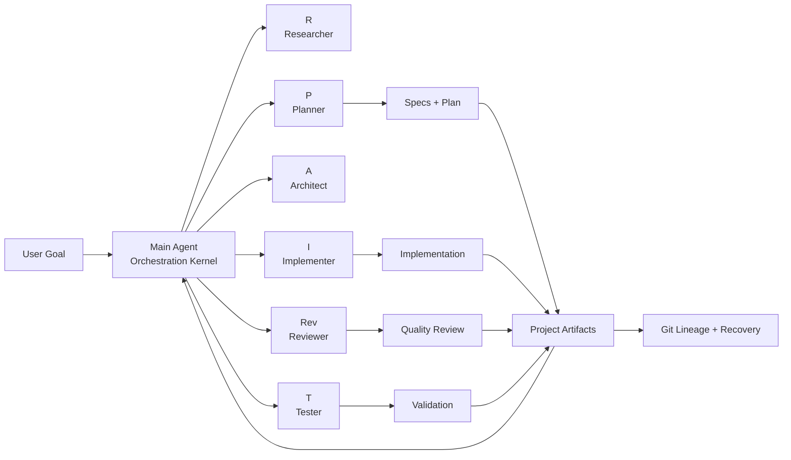
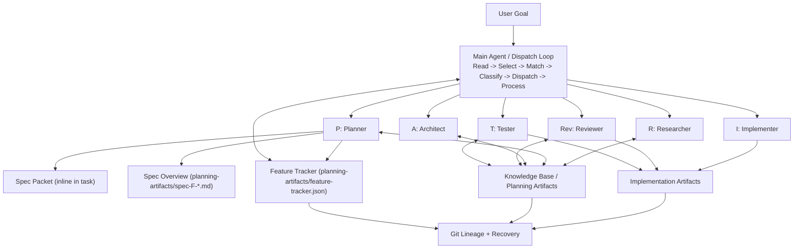

# Claude Code Context Engineering Template

A lightweight, project-agnostic template that turns Claude Code into a context-engineered multi-agent system.

## Content

- [What Is This?](#what-is-this)
- [Project Brief](#project-brief)
- [Quick Start](#quick-start)
- [Architecture](#architecture)
- [How It Works](#how-it-works)
- [Adding Agents](#adding-agents)
- [Project Structure](#project-structure)
- [Design Principles](#design-principles)
- [Context Engineering Framework](#context-engineering-framework)
- [Idea Organization and Prioritization](#idea-organization-and-prioritization)
- [Architectural Decisions Stress-Tested](#architectural-decisions-stress-tested)
- [Why This Matters](#why-this-matters)
- [Resources](#resources)
- [License](#license)

## What Is This?

This template encodes **Context Engineering**: controlling what enters an LLM context, when, in what form, and what stays externalized.

It provides a practical operating model where:

- A **Main Agent** (`CLAUDE.md`) acts as a stateless dispatcher
- **Specialized subagents** handle research, planning, architecture, implementation, review, and testing
- **Skills** provide reusable knowledge loaded on demand
- **Files** act as durable external memory across context compaction
- **Git** provides lineage, checkpoints, and recovery

## Project Brief

This repository is a reusable template focused on orchestration behavior, quality gates, and durable execution context.

It is markdown-first and zero-runtime by design: the core system behavior lives in agent/skill definitions and file conventions, not in application runtime code.

Primary purpose:

- Start new projects with a production-style multi-agent workflow
- Keep context usage controlled under long-running sessions
- Enforce consistent review/verification patterns
- Preserve project state in files that survive session resets

### Executive Diagram



## Quick Start

### Prerequisites
- Git installed
- Claude Code CLI installed

### 1. Clone or download template files

**Option A: Using degit (recommended)**
```bash
npx degit vospr/context-engineering-template my-project
cd my-project
git init
```

**Option B: Using git clone**
```bash
git clone https://github.com/vospr/context-engineering-template.git my-project
cd my-project
rm -rf .git
git init
```

### 2. Customize placeholder skills (Required)

Customize these files for your stack:

```bash
.claude/skills/coding-standards.md
.claude/skills/review-checklist.md
.claude/skills/testing-strategy.md
.claude/skills/architecture-principles.md
```

Validation check:

```bash
grep -r "\[PLACEHOLDER\]" .claude/skills/
```

### 3. Start Claude Code

```bash
claude
```

## Architecture

```
User Goal
  -> Dispatch Loop classifies complexity + spec_tier
  -> Planner authors spec (inline packet + feature overview)
  -> Implementer executes against assertions
  -> Post-task audit + Reviewer validation
  -> Feature tracker updates continuity state
  -> Next task dispatch
```



**[R]**esearcher - **[P]**lanner - **[A]**rchitect - **[I]**mplementer - **[Rev]**iewer - **[T]**ester

### Architectural Anchor

SDD is an external, verifiable, decomposable definition of done that survives context loss and keeps specification cost below ambiguity cost.

### Delivery Model (Thin Vertical Slice)

- **Slice 1 (MVP Pipeline):** minimum spec packet + controlled vocabulary + inline assertions + post-task audit
- **Slice 2 (Track & Continue):** feature tracker for continuity and zero-handoff resumption
- **Slice 3 (Govern & Verify):** constitution/gates (optional), two-layer verification, escalation
- **Slice 4 (Scale & Extend):** permanent agent extensions and reusable spec templates

### Key Architecture Decisions

- **ADR-001:** YAML spec packets + markdown feature overviews
- **ADR-002:** skill-first spec authoring, permanent agent extension deferred
- **ADR-003:** inline assertion verification first, then two-layer verification
- **ADR-004:** JSON feature tracker as continuity index
- **ADR-005:** progressive governance from lightweight protocol to optional constitution

### Dispatch Integration (SDD Mode)

- SDD activates when `spec-protocol.md` is present
- Dispatch loop adds spec-aware routing (`spec_tier`) on top of model routing
- Planner can be auto-dispatched to spec next unverified feature when task queue is empty
- `NEEDS_RESPEC` feedback triggers planner re-spec of affected subtree

### File Organization Rules

- Spec packets are embedded inline in task descriptions (no extra read hops for execution)
- Spec overviews are flat files in `planning-artifacts/` with `spec-F-{NNN}-{name}-overview.md` naming
- Feature progress state is tracked in `planning-artifacts/feature-tracker.json`

## How It Works

### The Dispatch Loop (CLAUDE.md)
1. **Read** current state from task system and artifacts
2. **Select** next unblocked task
3. **Match** task to best-fit specialized agent
4. **Classify** complexity and choose model level
5. **Dispatch** task with relevant context paths
6. **Process** result and update status
7. **Repeat** with periodic compaction/token checks

### Communication Patterns
| Pattern | When | How |
|---------|------|-----|
| One-Shot | Default | Single agent completes task independently |
| Worker-Reviewer | Implementation | Implementer <-> Reviewer loop, max 3 cycles |
| Parallel Fan-Out | Multi-perspective | Agents run in parallel on non-overlapping files |

### Token Budget
- Main Agent target: **<128k tokens** for end-to-end work
- Proactive compaction around **80k**
- Decisions/state persisted to files immediately
- Model economics: sonnet default, opus for complex architecture, haiku for lightweight tasks

## Adding Agents

Add a new `.md` file in `.claude/agents/` following `_agent-template.md`. The Main Agent discovers agents by directory scan.

## Project Structure

```
project-root/
├── CLAUDE.md                                    # Dispatch loop kernel (+3 lines for SDD)
├── README.md                                    # Project documentation
├── .gitignore                                   # Includes .env*, credentials.*, secrets/
│
├── .claude/
│   ├── agents/                                  # Self-discovering agent pool
│   │   ├── researcher.md                        # Web search, tech evaluation
│   │   ├── planner.md                           # Task DAG + spec authoring (Slice 4: permanent extension)
│   │   ├── architect.md                         # System design, tech selection
│   │   ├── implementer.md                       # Code writing, file editing
│   │   ├── reviewer.md                          # Code review + spec review (Slice 4: dual mode)
│   │   └── tester.md                            # Test execution + assertion execution (Slice 4: triple mode)
│   │
│   ├── skills/
│   │   ├── spec-protocol.md                     # [NEW: Slice 1] SDD core — format, vocabulary, assertions, governance seed
│   │   ├── coding-standards.md                  # Existing project-specific coding rules
│   │   ├── review-checklist.md                  # Review quality gate checklist
│   │   ├── testing-strategy.md                  # Existing testing approach
│   │   └── architecture-principles.md           # Architecture constraints and principles
│   │
│   └── spec-templates/                          # [NEW: Slice 4, optional] Reusable spec patterns
│       ├── rest-crud-endpoint.yaml              # Template for REST CRUD features
│       ├── auth-flow.yaml                       # Template for auth features
│       └── data-pipeline.yaml                   # Template for data processing features
│
├── planning-artifacts/
│   ├── feature-tracker.json                     # [NEW: Slice 2] Feature-level progress index
│   ├── constitution.md                          # [NEW: Slice 3, optional] Immutable project principles
│   ├── spec-F-001-{name}-overview.md            # [NEW: Slice 1] Per-feature spec overviews
│   ├── spec-F-002-{name}-overview.md
│   ├── decisions.md                             # Architectural/technology decision log
│   ├── project-status.md                        # Current phase, milestones, blockers
│   ├── session-context.md                       # Token compaction summaries
│   └── knowledge-base/                          # Shared context artifacts between agents
│       ├── README.md
│       └── failure-patterns.md                  # [NEW: Slice 3] Learning from past failures
│
├── implementation-artifacts/
│   └── (created at runtime by implementer/reviewer/tester)
│
└── docs/                                        # Project documentation (if applicable)
```

## Design Principles

1. **Stateless Dispatcher** - Main Agent stores no durable state in memory
2. **Delegated Mechanism Selection** - Subagents choose tools/mechanisms for their tasks
3. **File System as Memory** - Project context externalized to files
4. **Git as Lineage** - Recoverable history and checkpointing
5. **Graduated Context Loading** - Kernel + skills + on-demand files
6. **Self-Discovering Agent Pool** - Directory is registry

## Context Engineering Framework

This template implements six operational principles derived from context engineering research:

### 1. Context Offloading
Project state persists in files outside the context window - `planning-artifacts/`, `implementation-artifacts/`, and a decisions log. Git micro-commits act as checkpoints and provide recoverable lineage.

### 2. Context Retrieval
The Main Agent reads only what it needs: TaskList + latest artifacts. Agents load skills on demand via `setting_sources` and `skills` fields. New agents add themselves by dropping a file in `.claude/agents/` - no configuration changes required.

### 3. Context Reduction
A <128k token budget keeps the Main Agent compact across entire projects. Complexity classification routes simple lookups to haiku and reserves expensive models for architecture decisions. Task decomposition caps each unit at 3-5 files. Proactive compaction at 80k summarizes older turns.

### 4. Context Isolation
Six specialized agents run in separate contexts with only the tools they need. Parallel fan-out dispatches multiple agents on non-overlapping files. All implementation stays on feature branches, never main.

### 5. Context Orchestration
One universal dispatch pattern governs every project stage: read -> match agent -> classify complexity -> dispatch -> process result -> repeat. Three communication modes handle different scenarios (one-shot, worker-reviewer loop, parallel fan-out).

### 6. Context Governance
Reviewers follow a structured protocol: STATUS codes, numbered issues with severity ratings, and specific fix guidance for every finding. Circuit breaker caps worker-reviewer iterations at three cycles. Secret leak prevention operates in three layers: file exclusion, agent constraints, and automated hooks.

Reference links:

- `CLAUDE.md`
- `.claude/agents/_agent-template.md`
- `.claude/agents/planner.md`
- `.claude/agents/researcher.md`
- `.claude/agents/reviewer.md`
- `.claude/settings.json`
- `.claude/skills/git-workflow.md`
- `.gitignore`

## Idea Organization and Prioritization

The template was designed through a comprehensive brainstorming session using three techniques (First Principles Thinking, Morphological Analysis, Chaos Engineering), producing 50 design contexts organized into six context engineering themes.

### Context Offloading: File System as Externalized Memory

How project state is persisted outside the context window - `planning-artifacts/`, `implementation-artifacts/`, decisions log; Git = recoverable lineage

- **Structured status as markdown at known paths** - `CLAUDE.md:67-85` (Folder Conventions)
- **Git branch per feature for lineage** - `CLAUDE.md:120-125` (Git Workflow section)
- **Two-phase artifacts: planning -> implementation** - `CLAUDE.md:69-70`
- **Dual state architecture: Tasks for flow, Files for memory** - `.claude/agents/planner.md:4` + `CLAUDE.md:67-85`
- **Decisions written to files immediately** - `CLAUDE.md:8,111-113` (Principle 3)
- **Git micro-commits as checkpoints** - `.claude/skills/git-workflow.md:34-41`
- **Branch isolation - agents never work on main** - `CLAUDE.md:121`
- **Knowledge base as persistent RAG cache** - `planning-artifacts/knowledge-base/` (version-controlled, survives sessions)
- **Directory CLAUDE.md indexes as semantic maps** - `.claude/agents/CLAUDE.md`, `.claude/skills/CLAUDE.md`, `planning-artifacts/CLAUDE.md`

### Context Retrieval: Read Current State Each Cycle

- **Stateless Dispatcher** - `CLAUDE.md:6` (Principle 1: "Stateless")
- **Minimal Read Window** - `CLAUDE.md:14-16` (latest + next step only)
- **Task DAG for routing and dependencies** - `.claude/agents/planner.md:1-69`
- **Graduated context loading via setting_sources + skills** - `.claude/agents/_agent-template.md:6-7`
- **Self-discovering agent pool** - `CLAUDE.md:22-29`
- **Local-first RAG priority chain** - `.claude/agents/researcher.md:21-41`

### Context Reduction: Token Budget + Compaction + RAG

- **North Star: ship simple app in one 128k window** - `CLAUDE.md:9`
- **Compaction at 80k** - `CLAUDE.md:45-47,107-109`
- **Proactive compaction every 5 tasks** - `CLAUDE.md:45-47`
- **CLAUDE.md max 200 lines** - `CLAUDE.md:136-141`
- **Complexity classification for model selection** - `CLAUDE.md:31-34`
- **Task decomposition rule: 3-5 files max per task** - `.claude/agents/planner.md:26-30`

### Context Isolation: Specialized Subagents + Parallel Execution

- **Delegated Mechanism Selection** - `.claude/agents/_agent-template.md:4-8`
- **Worker-Reviewer autonomous quality loop** - `CLAUDE.md:54-59`
- **Parallel fan-out pattern** - `CLAUDE.md:61-65`
- **Dependency analysis prevents parallel file conflicts** - `.claude/agents/planner.md:20-23`

### Context Governance: Quality Gates + Security Controls

- **Hooks as automated quality gates** - `.claude/settings.json:2-14`
- **Circuit breaker: max 3 review cycles** - `CLAUDE.md:58-59,96-97`
- **Structured feedback protocol** - `CLAUDE.md:89-93` + `.claude/agents/reviewer.md:23-49`
- **MCP fallback chain** - `CLAUDE.md:131`
- **Secret leak defense layers** - `.gitignore:1-11` + `.claude/settings.json:3-12`

### Context Orchestration: Stateless Dispatcher Loop

- **Main Agent dispatches all stages** - `CLAUDE.md:7`
- **One universal dispatch pattern** - `CLAUDE.md:12-47`
- **Two-level split: Main Agent rules vs Subagent rules** - `CLAUDE.md` + `.claude/agents/*.md`

## Architectural Decisions Stress-Tested

The template architecture is designed for resilience against common failure classes:

- Context overflow
- Infinite review loops
- Parallel file conflicts
- Tooling/server failures
- Session interruption
- Secret leakage
- Cost runaway

## Why This Matters

Reliable multi-session delivery requires structured context, not just model capability. This template provides a practical baseline for predictable orchestration and recoverable project execution.

## Resources

- `CLAUDE.md`
- `.claude/agents/`
- `.claude/skills/`
- `planning-artifacts/`
- `implementation-artifacts/`

## License

MIT
